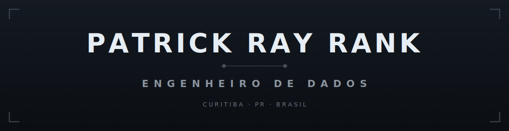

<!--  HEADER  -->

---

## Sobre

Quase 5 anos construindo pipelines, arquitetando Data Lakes e entregando soluções end-to-end em produção. Trabalho do servidor ao dashboard — infra Linux, Azure, AWS, Airflow, modelagem dimensional, APIs REST e Power BI. Do contrato com o fornecedor até o dado na mão do gestor.

Especializando em **Big Data pela Poli-USP**. Estudando **Databricks, dbt, Kafka e Snowflake**.

---

## Stack

| | |
|---|---|
| **Linguagens** | Python · SQL · Node.js · Shell |
| **Pipelines** | Apache Airflow · Spark · ETL/ELT · Pandas · Polars |
| **Cloud & Infra** | Azure · AWS · Docker · Linux · CI/CD · GitHub Actions |
| **Storage** | PostgreSQL · SQL Server · Delta Lake · Modelagem Dimensional |
| **BI** | Power BI · DAX · RLS · Streamlit · MLflow |
| **Aprendendo** | `Databricks` `dbt` `Apache Kafka` `Snowflake` |

---

## Stats

---

## Projetos

| Repositório | Stack | Área |
|---|---|---|
| [big-data-retail-pipeline](https://github.com/RayRank/big-data-retail-pipeline) | PySpark · Databricks · Delta Lake | Big Data · Volume massivo |
| [data-governance-lgpd-pipeline](https://github.com/RayRank/data-governance-lgpd-pipeline) | PostgreSQL · dbt · Python | Governança · LGPD · Lineage |
| [fraud-detection-pipeline](https://github.com/RayRank/fraud-detection-pipeline) | PySpark · MLflow · Streamlit | Fraude · ML · Séries temporais |
| [realtime-streaming-kafka](https://github.com/RayRank/realtime-streaming-kafka) | Kafka · PySpark · Docker | Streaming · Near real-time |
| [analytics-engineering-dbt](https://github.com/RayRank/analytics-engineering-dbt) | dbt · PostgreSQL · GitHub Actions | Analytics Engineering |

---

## Formação

| | |
|---|---|
| **Engenharia de Dados & Big Data** *(lato sensu)* | Escola Politécnica da USP (PECE) · 2025–2026 |
| **Análise e Desenvolvimento de Sistemas** | Estácio · 2018–2021 |

---

rayrank10@gmail.com · linkedin.com/in/patrick-ray-rank

